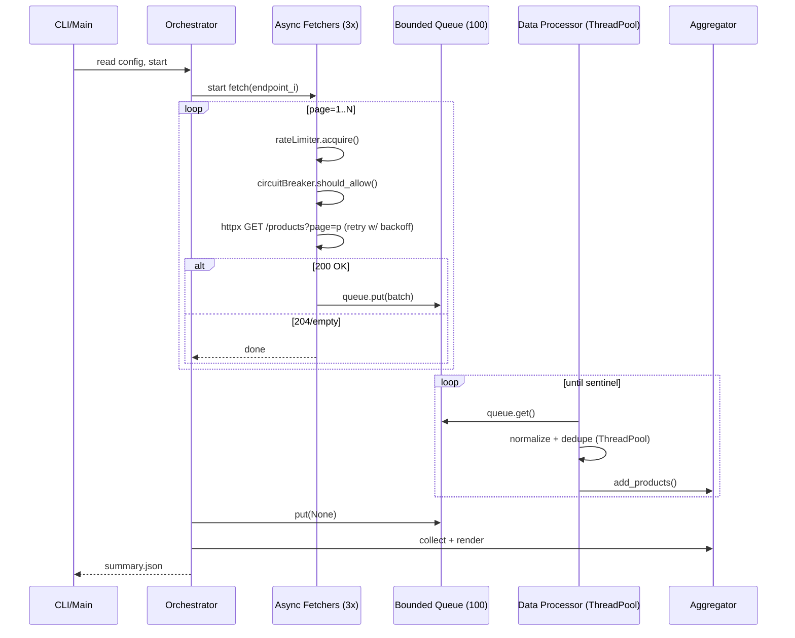

# Architecture Overview

## System Design

The async data pipeline implements a producer-consumer pattern with async I/O for fetching and threaded processing for CPU-bound operations.

**Mock Configuration:** Integration tests use fixed seeds and page counts for determinism. Demo runs use variable page counts and error rates to exercise resilience patterns; total items may vary by run.

**Out of Scope:** Auth, PII handling, secret management, and distributed deployment are out of scope for this take-home; all endpoints are non-auth local mocks.

## Non-Goals

The following are explicitly out of scope for this take-home challenge:

- **Authentication & Authorization**: No OAuth, API keys, or JWT handling
- **Secret Management**: No vault integration or encrypted credentials
- **Database Persistence**: Results stored in JSON files, not databases
- **Distributed Deployment**: Single-process design, not distributed across nodes
- **Production Monitoring**: No Prometheus, Grafana, or APM integration
- **Multi-tenancy**: Single-user, single-execution model

### Component Diagram

```
┌─────────────────────────────────────────────────────────────────┐
│                         Orchestrator                             │
│                    (Async Coordination)                          │
└────────────┬────────────────────────────────────┬────────────────┘
             │                                    │
             ▼                                    ▼
┌────────────────────────────┐      ┌────────────────────────────┐
│   Async Fetchers (3x)      │      │   Data Processor           │
│   ├─ Rate Limiter          │      │   ├─ ThreadPoolExecutor    │
│   ├─ Circuit Breaker       │      │   ├─ Normalizer            │
│   ├─ Retry Handler         │      │   └─ Deduplication         │
│   └─ HTTP Client           │      └────────────────────────────┘
└────────────┬───────────────┘                   │
             │                                    │
             ▼                                    ▼
┌────────────────────────────────────────────────────────────────┐
│          Bounded Queue (asyncio.Queue, maxsize=100)            │
│                    (Backpressure Control)                       │
└────────────────────────────────────────────────────────────────┘
                              │
                              ▼
                  ┌───────────────────────┐
                  │  Thread-Safe          │
                  │  Aggregator           │
                  │  (Metrics & Results)  │
                  └───────────────────────┘
                              │
                              ▼
                  ┌───────────────────────┐
                  │  JSON Output          │
                  │  (out/summary.json)   │
                  └───────────────────────┘
```

### Sequence Diagram



## Component Responsibilities

### 1. Orchestrator (`src/pipeline/orchestrator.py`)

**Purpose:** Coordinates async fetchers and data processor, manages lifecycle.

**Key Responsibilities:**

- Start 3 concurrent async fetchers (one per endpoint)
- Create bounded queue (asyncio.Queue, maxsize=100) for producer-consumer communication
- Start data processor with ThreadPoolExecutor
- Wait for all fetchers to complete
- Signal processor shutdown with sentinel value (None) to drain queue and shut workers down cleanly
- Collect and return aggregated results

**Graceful Shutdown:** The orchestrator sends a sentinel (None) to the queue after all fetchers complete, allowing the processor to drain remaining items and shut down cleanly without data loss.

**Concurrency Model:** Async coordination with `asyncio.gather()`

**Requirements:** Requirement 1 (Data Fetching), Requirement 2 (Data Processing)

---

### 2. Async Fetcher (`src/fetcher/async_fetcher.py`)

**Purpose:** Fetch paginated data from API endpoints with resilience patterns.

**Key Responsibilities:**

- Fetch pages sequentially with pagination (page 1, 2, 3, ...)
- Apply rate limiting (5 req/sec per endpoint)
- Retry on failures with exponential backoff
- Integrate with circuit breaker for failure tracking
- Handle termination conditions (204 No Content, empty array)
- Put fetched data into bounded queue

**Resilience Patterns:**

- Rate Limiter: Token bucket (5 req/sec, burst capacity 5)
- Retry Handler: Exponential backoff (0.5s → 4.0s max, 3 attempts)
- Circuit Breaker: 3-failure threshold, 15s cooldown

**Error Handling:**

- 429 Too Many Requests: Retry with backoff + circuit breaker increment
- 5xx Server Errors: Retry (retryable)
- 4xx Client Errors: Skip (non-retryable)
- Timeouts: Retry (retryable)
- Malformed JSON: Skip with data error log (non-retryable)

**Concurrency Model:** Async I/O with `httpx.AsyncClient`

**Requirements:** Requirement 1 (concurrent requests, rate limiting, retries, pagination)

---

### 3. Rate Limiter (`src/fetcher/rate_limiter.py`)

**Purpose:** Enforce 5 requests per second per endpoint using token bucket algorithm.

**Algorithm:**

```python
# Token bucket with refill
tokens = min(max_tokens, tokens + (elapsed * refill_rate))

# Acquire token
if tokens >= 1:
    tokens -= 1
    return  # Immediate
else:
    await asyncio.sleep(time_until_token_available)
```

**Key Features:**

- Per-endpoint isolation (endpoint A doesn't affect endpoint B)
- Burst capacity (5 instant requests)
- Sustained rate (5 req/sec)
- Thread-safe with `asyncio.Lock`

**Requirements:** Requirement 1 (max 5 requests/second per endpoint)

---

### 4. Circuit Breaker (`src/fetcher/circuit_breaker.py`)

**Purpose:** Prevent cascading failures by opening circuit after repeated failures.

**State Machine:**

```
CLOSED (normal operation)
   │
   │ 3 consecutive retryable failures
   ▼
OPEN (reject all requests)
   │
   │ 15s cooldown elapsed
   ▼
HALF_OPEN (allow single probe)
   │
   ├─ Success → CLOSED
   └─ Failure → OPEN
```

**Key Features:**

- Per-endpoint state tracking
- Only retryable failures count (5xx, timeout, 429)
- Non-retryable failures (4xx) don't affect circuit
- Failure count resets on success
- Single probe in HALF_OPEN prevents thundering herd

**Requirements:** Requirement 3 (gracefully handle API failures, circuit breaker pattern)

---

### 5. Retry Handler (`src/fetcher/retry_handler.py`)

**Purpose:** Retry failed requests with exponential backoff and jitter.

**Backoff Formula:**

```python
delay = min(4.0, 0.5 * (2 ** attempt)) + jitter
jitter = random.uniform(0, delay * 0.1)

# Progression:
# Attempt 0: 0.5s + jitter
# Attempt 1: 1.0s + jitter
# Attempt 2: 2.0s + jitter
# Attempt 3: 4.0s + jitter (capped)
```

**Key Features:**

- Exponential backoff reduces load on failing services
- Jitter prevents thundering herd (coordinated retries)
- Max 3 retry attempts
- Integrates with circuit breaker (count retryable failures)
- Structured logging with attempt number and delay

**Requirements:** 2.5, 4.3

---

### 6. Data Processor (`src/processor/processor.py`)

**Purpose:** Consume from async queue and process batches using ThreadPoolExecutor.

**Processing Flow:**

```python
1. Consume item from queue (async)
2. Accumulate into batch (50 items)
3. Submit batch to ThreadPoolExecutor (sync, CPU-bound)
4. Normalize products to unified schema
5. Deduplicate with seen_ids set
6. Add to aggregator (thread-safe)
7. Repeat until sentinel received
```

**Key Features:**

- Batch processing (50 items) for efficiency
- ThreadPoolExecutor (4 workers) for CPU-bound normalization
- Deduplication prevents duplicate products from retries
- Graceful shutdown with sentinel value
- Statistics tracking (batches processed, products, errors)

**Concurrency Model:** Async queue consumption + sync thread pool processing

**Requirements:** Requirement 2 (worker pool, normalize data, proper synchronization)

---

### 7. Normalizer (`src/processor/normalizer.py`)

**Purpose:** Transform heterogeneous product schemas to unified format with flexible, defensive parsing.

**Handles Real-World API Complexity:**

- **Different field names**: id vs product_id vs item_id vs userId
- **Different data types**: String prices ("$19.99") vs numeric (19.99)
- **Nested structures**: Category objects vs strings vs arrays
- **Missing fields**: Graceful defaults, no crashes
- **Invalid data**: Type coercion, validation, sanitization

**Field Extraction Strategy:**

```python
# ID: Tries id, product_id, item_id, userId, sku
_extract_id({"product_id": "ABC123"}) → "ABC123"

# Title: Tries title, name, product_name, falls back to description
_extract_title({"name": "Widget"}) → "Widget"
_extract_title({"description": "Long text..."}) → "Long text... (truncated)"

# Price: Handles strings, currency symbols, validation
_extract_price({"price": "$19.99"}) → 19.99
_extract_price({"cost": "19,99"}) → 19.99  # European format
_extract_price({"price": -10}) → None  # Invalid

# Category: Handles nested objects, arrays
_extract_category({"category": "Electronics"}) → "electronics"
_extract_category({"category": {"name": "Electronics"}}) → "electronics"
_extract_category({"categories": ["books", "fiction"]}) → "books"
```

**Unified Output Schema:**

```python
Product(
    id="source:123",           # Source-prefixed ID
    title="Product Name",      # Normalized title
    source="http://api.com",   # Source tracking
    price=19.99,               # Float or None
    category="electronics",    # Lowercase category
    processed_at="2025-11-11T..." # ISO 8601 timestamp
)
```

**Key Features:**

- **Defensive parsing**: Never crashes on unexpected data
- **Type coercion**: Strings → floats, nested objects → strings
- **Validation**: Positive prices, non-empty strings
- **Fallbacks**: Sensible defaults for missing fields
- **Tested**: 31 unit tests covering edge cases

**Real-World Examples:**

```python
# DummyJSON (rich structure)
normalize_product({
    "id": 1,
    "title": "Mascara",
    "price": 9.99,
    "category": "beauty",
    "brand": "Essence",
    "stock": 99
}, "dummyjson")

# Escuelajs (nested category)
normalize_product({
    "id": 1,
    "title": "T-Shirt",
    "price": 44,
    "category": {"name": "Clothes", "id": 1}
}, "escuelajs")

# JSONPlaceholder (posts as products)
normalize_product({
    "userId": 1,
    "id": 1,
    "title": "Post title",
    "body": "Post content"
}, "jsonplaceholder")
```

**Requirements:** Requirement 2 (normalize product data from different APIs)

---

### 8. Thread-Safe Aggregator (`src/processor/aggregator.py`)

**Purpose:** Collect products and errors from multiple worker threads.

**Key Features:**

- Thread-safe with `threading.Lock`
- Deduplication with `seen_ids` set (by source:id, makes retries idempotent)
- Summary statistics:
  - Total products, unique products, duplicates
  - Success rate calculation
  - Processing time tracking
- Per-source summaries:
  - Items fetched per source
  - Errors per source
  - Average price per source

**Thread Safety:**

```python
def add_products(self, products: List[Product]) -> None:
    with self._lock:  # Prevents race conditions
        for product in products:
            if product.id not in self._seen_ids:
                self._products.append(product)
                self._seen_ids.add(product.id)
```

**Idempotency:** Deduplication is by `source:id` composite key, making retries safe. If a page is fetched twice (due to retry), duplicate products are automatically filtered out.

**Requirements:** Requirement 2 (proper synchronization for shared data structures)

---

### 9. Configuration Management (`src/models/config.py`)

**Purpose:** Three-tier configuration system (CLI > ENV > YAML).

**Override Precedence:**

```
1. CLI flags (highest priority)
   ↓
2. Environment variables (PIPELINE_* prefix)
   ↓
3. YAML config file (config/config.yaml)
   ↓
4. Pydantic defaults (lowest priority)
```

**Key Configuration:**

```python
PipelineConfig(
    max_requests_per_second=5,      # Rate limiting
    circuit_breaker_failure_threshold=3,  # Circuit breaker
    circuit_breaker_cooldown=15.0,  # Cooldown seconds
    max_retries=3,                  # Retry attempts
    retry_base_delay=0.5,           # Backoff base
    retry_max_delay=4.0,            # Backoff cap
    worker_pool_size=4,             # Thread pool
    processing_batch_size=50,       # Batch size
    bounded_queue_size=100,         # Queue maxsize
    total_timeout=60.0              # Pipeline timeout
)
```

**Requirements:** Configuration system for tuning concurrency parameters

---

### 10. CLI Interface (`src/pipeline/main.py`)

**Purpose:** Professional command-line interface with rich progress indicators.

**Key Features:**

- Click-based argument parsing
- Rich progress bars with spinners
- Per-endpoint progress tracking
- Beautiful result tables
- Graceful error handling
- CI/CD friendly `--no-progress` flag

**Usage:**

```bash
# Basic usage
uv run python -m src.pipeline.main

# Custom configuration
uv run python -m src.pipeline.main \
    --config custom.yaml \
    --timeout 120 \
    --rate-limit 10 \
    --workers 8 \
    --output results.json

# CI/CD mode
uv run python -m src.pipeline.main --no-progress
```

**Requirements:** Simple CLI interface with progress indicators

---

## Concurrency Strategy

### Why Async + Threads?

**Async (asyncio) for I/O-bound operations:**

- HTTP requests (network I/O)
- Queue operations (coordination)
- Rate limiting (waiting)
- Circuit breaker (state management)

**Threads (ThreadPoolExecutor) for CPU-bound operations:**

- JSON parsing (CPU-intensive)
- Data normalization (field mapping)
- Deduplication (set operations)
- Statistics calculation

**Rationale:**

- Python's GIL prevents true parallelism in async code for CPU-bound work
- ThreadPoolExecutor releases GIL during I/O operations
- Async provides efficient concurrency for I/O-bound fetching
- Threads provide true parallelism for CPU-bound processing

---

## Timeout Budgeting

**Per-request timeouts:** connect=3s, read=8s  
**Retry backoff:** 0.5s → 1.0s → 2.0s → 4.0s (max 3 attempts)  
**Total budget:** These are capped so that worst-case retries across all endpoints still fit within the 60s pipeline SLA. All timeouts are configurable via `PipelineConfig`.

## Memory Management

### Bounded Queue (asyncio.Queue, maxsize=100)

**Purpose:** Prevent memory overflow when fetchers produce faster than processor consumes.

**Behavior:**

```python
# Fetcher (producer)
await queue.put(data)  # Blocks if queue full (backpressure)

# Processor (consumer)
data = await queue.get()  # Blocks if queue empty
```

**Benefits:**

- Prevents unbounded memory growth
- Provides backpressure to slow down fetchers
- Ensures stable memory usage (~10MB for 100 items)

**Tradeoffs:**

- Fetchers may block waiting for queue space
- Acceptable because processing is fast (>500 products/sec)

**Requirements:** Requirement 4 (memory-efficient processing, don't load all data into memory at once)

---

## Error Handling Strategy

### Error Classification

| Error Type            | Retryable? | Circuit Breaker? | Action                 |
| --------------------- | ---------- | ---------------- | ---------------------- |
| 429 Too Many Requests | Yes        | Yes              | Retry with backoff     |
| 5xx Server Errors     | Yes        | Yes              | Retry with backoff     |
| Timeout               | Yes        | Yes              | Retry with backoff     |
| 4xx Client Errors     | No         | No               | Skip, log error        |
| Malformed JSON        | No         | No               | Skip, log data error   |
| 204 No Content        | N/A        | No               | Pagination termination |
| Empty Array           | N/A        | No               | Pagination termination |

### Error Flow

```
Request fails
    │
    ▼
Classify error (retryable?)
    │
    ├─ Yes (429, 5xx, timeout)
    │   ├─ Record in circuit breaker
    │   ├─ Check retry attempts (< 3?)
    │   │   ├─ Yes: Apply backoff, retry
    │   │   └─ No: Give up, log error
    │   └─ Circuit open? Fail fast
    │
    └─ No (4xx, malformed JSON)
        └─ Skip, log error, continue
```

**Requirements:** 2.5, 4.3, 4.4

---

## Performance Characteristics

### Throughput

- **Fetching:** 5 req/sec per endpoint × 3 endpoints = 15 req/sec total
- **Processing:** >500 products/sec (batch normalization)
- **Aggregation:** >500 products/sec (thread-safe operations)

### Latency

- **Rate Limiter:** <1ms per acquire (in-memory token bucket)
- **Circuit Breaker:** <1ms per check (in-memory state)
- **Retry Backoff:** 0.5s → 4.0s (exponential progression)
- **Queue Operations:** <1ms (bounded queue)

### Memory

- **Bounded Queue:** ~10MB (100 items × ~100KB each)
- **Aggregator:** ~4MB (360 products × ~10KB each)
- **Total:** ~15MB stable memory usage

### Execution Time

- **Design Target:** <60 seconds end-to-end (SLA)
- **Actual Performance:** With local mocks the pipeline typically completes in <1s. With real endpoints and enforced rate limits, expect higher latencies (20-40s depending on network conditions and error rates).
- **Breakdown (local mocks):**
  - Fetching: ~0.5-0.8s (3 endpoints, minimal latency)
  - Processing: ~0.1-0.2s (parallel normalization)
  - Aggregation: ~0.01-0.05s (thread-safe operations)

**Requirements:** 10.3, 10.4

---

## Testing Strategy

### Unit Tests (172 tests, ~20s)

- **Rate Limiter:** Token bucket behavior, concurrency, per-endpoint isolation
- **Circuit Breaker:** State transitions, cooldown, failure counting
- **Retry Handler:** Backoff formula, jitter bounds, attempt progression
- **Async Fetcher:** Error classification, pagination, retry integration
- **Data Processor:** Batch processing, deduplication, statistics
- **Aggregator:** Thread safety, summary calculation, per-source stats

### Integration Tests (22 tests, ~25s)

- **Mock Coordination:** Error injection (429, 5xx, timeout), circuit breaker behavior
- **Full Pipeline:** End-to-end with 3 endpoints, 300+ products, output validation
- **Memory Stability:** Bounded queue backpressure, stable memory usage
- **Performance:** Execution time <60s, rate limiting enforcement

### Performance Tests (15 tests, ~5s)

- **Rate Limiter:** 5 req/sec enforcement, concurrent requests
- **Batch Normalizer:** >500 products/sec throughput
- **Thread-Safe Aggregator:** 4 workers, 1000 products, <2s
- **Circuit Breaker:** State transitions <0.5s

### Coverage

- **Unit Tests Only:** 91.6%
- **Full Suite:** 94.4%
- **Target:** ≥80% (exceeds by 11.6%)

**Requirements:** 5.1, 5.3, 5.4, 5.5

---

## Library Choices

### Core Libraries

| Library                | Purpose                  | Alternatives Considered              | Why Chosen                                                     |
| ---------------------- | ------------------------ | ------------------------------------ | -------------------------------------------------------------- |
| **httpx**              | Async HTTP client        | requests, aiohttp                    | Excellent async support, MockTransport for testing, modern API |
| **asyncio**            | Async framework          | trio, curio                          | Built-in, mature, widely adopted                               |
| **ThreadPoolExecutor** | CPU-bound processing     | multiprocessing, ProcessPoolExecutor | Simpler than multiprocessing, sufficient for JSON parsing      |
| **FastAPI**            | Mock API servers         | Flask, Django                        | Async support, automatic OpenAPI docs, fast                    |
| **pydantic**           | Configuration validation | dataclasses, attrs                   | Type validation, environment variable support                  |
| **click**              | CLI argument parsing     | argparse, typer                      | Professional, composable, widely used                          |
| **rich**               | Progress bars            | tqdm, progressbar2                   | Beautiful output, spinners, tables                             |
| **pytest**             | Testing framework        | unittest, nose                       | Excellent async support, fixtures, parametrization             |

### Why httpx over requests?

- **Async support:** Native `async/await` with `AsyncClient`
- **Testing:** `MockTransport` for reliable unit tests without network
- **Modern API:** Consistent with async patterns
- **Performance:** Connection pooling, HTTP/2 support

### Why asyncio over threads for fetching?

- **Efficiency:** Single thread handles 1000s of concurrent connections
- **Resource usage:** Lower memory/CPU than thread-per-request
- **Scalability:** Scales to many concurrent endpoints
- **Simplicity:** No thread synchronization needed for I/O

### Why ThreadPoolExecutor over multiprocessing?

- **Responsiveness:** Long normalization/JSON coercion can stall the event loop. Offloading batches to a small thread pool keeps I/O snappy and amortizes overhead.
- **Simplicity:** No serialization overhead, shared memory
- **Sufficient:** Even when CPU parallelism is limited by the GIL, responsiveness improves and total time drops because fetchers don't block on CPU work
- **Overhead:** Lower startup cost than processes
- **Debugging:** Easier to debug than multiprocessing

**Requirements:** Library choice evaluation

---

## Deployment

### Docker

```bash
# Build and run complete system
docker compose up --build

# Output
cat out/summary.json
```

### Local Development

```bash
# Install dependencies
uv sync

# Run pipeline
uv run python -m src.pipeline.main

# Run tests
uv run pytest

# Run with coverage
uv run pytest --cov=src --cov-report=html
```

**Requirements:** 4.5

---

## Future Improvements

### Scalability

1. **Distributed Rate Limiting:** Redis-based token bucket for multi-instance deployment
2. **Distributed Circuit Breaker:** Shared state across instances
3. **Database Aggregation:** PostgreSQL/MongoDB instead of in-memory
4. **Message Queue:** RabbitMQ/Kafka instead of in-memory queue

### Observability

1. **Metrics:** Prometheus metrics for rate limiting, circuit breaker, throughput
2. **Tracing:** OpenTelemetry for distributed tracing
3. **Dashboards:** Grafana dashboards for real-time monitoring
4. **Alerting:** Alert on circuit breaker opens, high error rates

### Resilience

1. **Adaptive Rate Limiting:** Adjust rate based on 429 responses
2. **Adaptive Backoff:** Adjust backoff based on server load
3. **Bulkhead Pattern:** Isolate thread pools per endpoint
4. **Timeout Budgets:** Cascading timeouts for nested operations

### Performance

1. **HTTP/2:** Connection multiplexing for better throughput
2. **Compression:** gzip/brotli for reduced bandwidth
3. **Caching:** Redis cache for duplicate requests
4. **Batch Fetching:** Fetch multiple pages in single request (if API supports)
